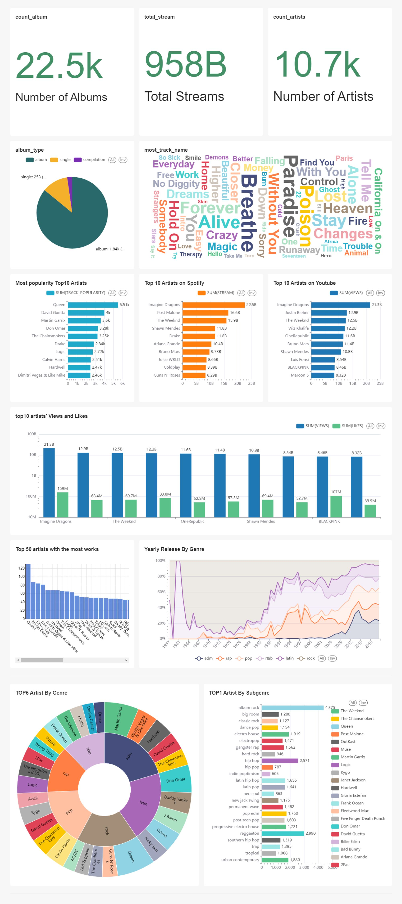
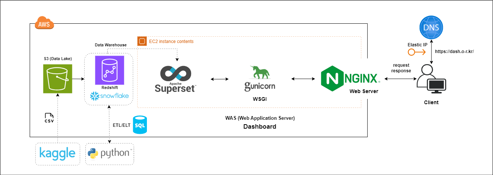

# dev-course-project-02
[2기] 프로그래머스 데이터 엔지니어링 2차 프로젝트

# 프로젝트 주제
음악 데이터 웨어하우스 구축: Spotify 분석을 위한 통합 대시보드 만들기

 

## 결과물 (대시보드)

## 아키텍처

### 프로젝트 선정 이유
Spotify를 중심으로 스트리밍 시장의 상태를 파악하고, 전 세계 사용자들이 선호하는 음악 장르와 아티스트의 경향을 분석하기 위함
이를 통해 글로벌 음악 시장의 동향을 이해하고, 스트리밍이 음악 산업에 미치는 영향을 더 깊이 있게 탐구할 목적임

### 기대효과
Spotify 데이터를 가공하고 시각적으로 표현하는 경험은 실무에서 유용하게 쓰일 것으로 기대
대시보드를 통해 사용자들에게 음악 추천, 음악 트렌드 예측, 음악 장르 분석 등의 유용한 인사이트를 제공
추후 음악 추이 예측 및 추천 등 개인화된 정보를 제공함으로써 음악 청취 경험을 향상시킬 수 있을 것으로 기대

### 역할
팀원들은 프로젝트를 데이터 적재부터 데이터 웨어하우스 구축, 그리고 대시보드 생성까지의 모든 단계를 A부터 Z까지 각자 진행함. 그리고 마지막으로 각자의 장점을 살려서 결과물을 통합하여 최종 결과물을 만듬

### 활용 언어 및 기술
Python, SQL, Snowflake, Superset, AWS S3, EC2, Redshift

### 활용 데이터 
30000 spotify songs : https://www.kaggle.com/datasets/joebeachcapital/30000-spotify-songs
    
Spotify and Youtube : https://www.kaggle.com/datasets/salvatorerastelli/spotify-and-youtube/data

### 개선점 / 회고
현재 하나의 EC2에 Gunicorn과 Nginx를 직접 설치해 셋팅했지만 하나의 EC2 인스턴스에서 직접 Gunicorn과 Nginx를 사용하는 대신 Load Balancer or Reverse Proxy, Superset Container, Database Container, Redis Container, Worker Container와 같은 컨테이너를 활용한 아키텍처로 전환하는 것이 바람직하다고 생각함

Gunicorn을 직접 설치하고 워커 수를 설정해보며, 백그라운드에서 실행하기 위한 설정 파일을 작성하는 과정, 그리고 Nginx를 설치하고 프록시 서버 설정을 직접해보는 과정,  Nginx에 SSL/TLS 인증서를 적용해본 경험에서 많은 것을 배웠다고 생각함. 이러한 경험은 시스템의 내부 작동 방식에 대한 이해를 깊게 하고, 실제 환경에서 발생할 수 있는 다양한 문제들을 대응하는 능력을 키우는 데 큰 도움이 되었다고 생각됨

CSV 파일을 Amazon S3에 직접 업로드하고 ETL또는 ELT 작업을 수동으로 수행하는 현재의 프로세스는 새로운 데이터가 지속적으로 발생하게 된다면 비효율적이고 시간 소모적일 수 있겠다라는 생각을 했고, 따라서 이러한 작업을 자동화하여 관리할 필요가 있겠다라는 생각을 함

